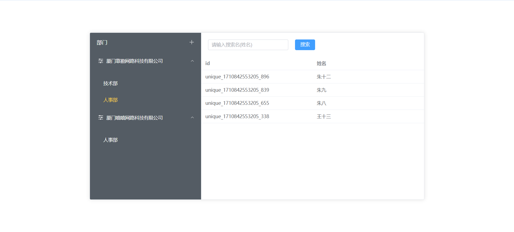

# Hixtrip FE Online

## 准备

- fork 此仓库
- 根据如下要求实现相关代码
- 完成要求
  - 提交`pull request`
  - 提供页面截图

## 需求

1. 目前已经有`src/api/user.ts` 以及 `src/api/org.ts` 两个 API
2. 需要实现如下效果界面：



> 功能要求：
- 不限 ```React``` 或者 ```Vue```
- 需要拆分 `OrgTree` 以及 `UserTable` 两个组件
  - 两个组件自己维护相关的数据。
  - 体现两个组件的互相通信。
- 组织架构根据点上级节点进行查询子级节点实现异步加载。
- 用户 ```Table ``` 数据跟据点击 ```组织架构树形节点``` 以及 ```输入搜索关键字``` 查询。
  - 需要考虑防抖节流等功能点
- 风格不限
  - 示例图仅仅是效果展示，不需要完全符合。
  - 可以使用 ```UI Framework```, 如 ```ant-design```, ```element-ui```等
  - 如果不用```UI Framework```, 可以直接用原生的```<ul> <li>```, ```<table>``` 实现，不用实现相关的CSS样式, 可以加分。

## 其他简答题

### 如何将如下的`JSON`正确解析成 `Object`
```json
{
  "userId": 111323290434354540545
}
```

====》我一般是使用JSON.parse(),可以把json格式的字符串转为对象


### 前端需要*稳定*每隔`1s`向服务端请求`API`, 请问如何实现？


====》因为浏览器的页面如果是不可见的状态会失活，用定时器的时候，浏览器会优化定时时间。是不稳定的
====》但是在浏览器不切换页面,用setInterval,用前一个时间和定时到的时间相比,也会有几毫秒的间隔,也不 稳定吧
====》感觉是要设一个 间隔50ms,定时到期的时间减去 前一个的时间如果在 间隔之内，就算 1s了。
====》如果是失活后，再切换回来，重新设置
var preTime=new Date().getTime(); 
var gapTime=50;  //现在时间 减去 前一个时间间隔50毫秒以内，算1s
function stableTime(callback){
  requestAnimationFrame(function(){ //失活时不会触发渲染，setInterval会出发
    var now=new Date().getTime(); 
    var disTime=now-preTime;
    if(disTime>2000){   //失活页面再切换回来,大于2秒的时候
      preTime=now;
    }else if(disTime>1000+gapTime){  //   
      preTime=preTime+1000;
    }else if(disTime>(1000-gapTime) && disTime<(1000+gapTime)){ 
      console.log("这边作为稳定1s的间隔时间")  // 
      callback && callback();
      preTime=now;
    }
    stableTime();
  })
}
stableTime()


### 什么情况下，你会为你的项目引入状态管理库，比如`Redux`, `Pinia`, 可以简述一下起到了什么作用么？


====》当数据作为整个应用的通用数据的时候，或是组件间通讯比较复杂,嵌套的层数比较多(这时候如果不用全局式的方式，数据的流通会比较混乱) 。 
====》作为全局状态管理的,可以比较好的追述数据的变化，对组件间的通讯比较好处理。

### 为什么`ESM`与`CJS`不能兼容？

====》这个不清楚。
====>cjs是nodejs最初采用的模块系统，其设计基于同步加载和运行时执行的,一般是用require来引用模块的，并且模块导出的值是浅拷贝。
====》esm是ECMAScript自己的模块体系，其导出的值是值得引用，是在编译时确定的引用状态。
====》使用上，对于vite来说要用import，因为vite是利用浏览器原生自带esm的特性，import的模块会产生一个http链接,结合nodejs通过拦截、去解析这个http，然后返回解析好的内容。


====》总结：
1、因为对vue2比较熟悉，所以是用 vue2.7来做的（因为@vitejs/plugin-vue2这个解析.vue的文件只能解析vue2.7的）
2、对typeScript不是很熟悉,就没有添加一些输入、输出类型，用js来做的
3、页面上的内容说明：
左边树：
1.当前标题没有children 元素，就去请求接口，添加数据，如果有children元素就是打开和关闭了。
2.第四级的元素点击，不请求接口。

右边表格：
1.搜索输入框，输入的时候懒加载请求数据

