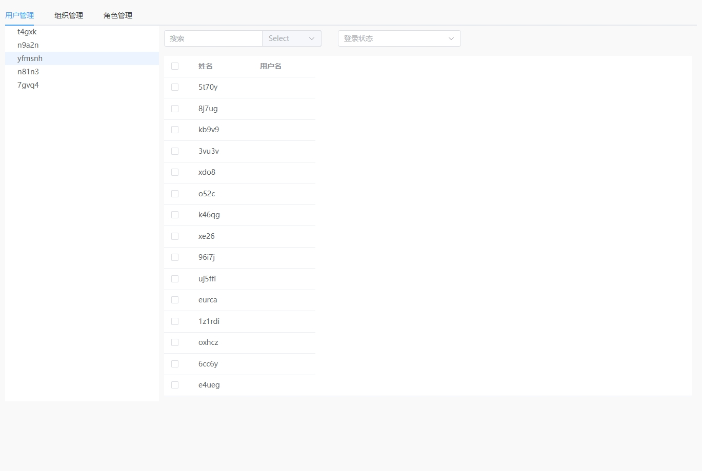

# Hixtrip FE Online

## 准备

- fork 此仓库
- 根据如下要求实现相关代码
- 完成要求
  - 提交`pull request`
  - 提供页面截图

## 需求

1. 目前已经有`src/api/user.ts` 以及 `src/api/org.ts` 两个 API
2. 需要实现如下效果界面：


> 功能要求：
- 不限 ```React``` 或者 ```Vue```
- 需要拆分 `OrgTree` 以及 `UserTable` 两个组件
  - 两个组件自己维护相关的数据。
  - 体现两个组件的互相通信。
- 组织架构根据点上级节点进行查询子级节点实现异步加载。
- 用户 ```Table ``` 数据跟据点击 ```组织架构树形节点``` 以及 ```输入搜索关键字``` 查询。
  - 需要考虑防抖节流等功能点
- 风格不限
  - 示例图仅仅是效果展示，不需要完全符合。
  - 可以使用 ```UI Framework```, 如 ```ant-design```, ```element-ui```等
  - 如果不用```UI Framework```, 可以直接用原生的```<ul> <li>```, ```<table>``` 实现，不用实现相关的CSS样式, 可以加分。

效果图：

## 其他简答题

### 如何将如下的`JSON`正确解析成 `Object`
```json
{
  "userId": 111323290434354540545
}
```

答：
- 使用BigInt，处理完数字型会有后缀“n”
```
function jsonToObj(todoJson){
    const turnJson = JSON.parse(todoJson);
    turnJson.userId = BigInt(turnJson.userId);
    return turnJson
}
const todoJson = '{"userId":"111323290434354540545"}';
console.log(jsonToObj(todoJson));
```
### 前端需要*稳定*每隔`1s`向服务端请求`API`, 请问如何实现？
答：有两种情况：
- 单纯接口请求仅使用setInterval
```
setInterval(()=>{
    api.then((res)=>{
        //数据处理
    })
},1000)
```
- 触及到类似心跳的功能建议使用websocket+setInterval
```
const Ws = new WebSocket('ws://127.0.0.1:8888/ws');
Ws.onopen = onOpen;
Ws.onmessage = onMessage;
Ws.onclose = onClose;
Ws.onerror = onError;
const onOpen = ()=>{};
const onMessage = ()=>{};
const onClose = ()=>{};
const onError = ()=>{};
setInterval(()=>{
    Ws.send()
},1000)
```
### 什么情况下，你会为你的项目引入状态管理库，比如`Redux`, `Pinia`, 可以简述一下起到了什么作用么？
答：一般在项目中涉及到跨页面交互的。比如后台管理系统：一些用户信息、组织机构信息、常用的系统配置、甚至与对话弹框的状态等等都可能用到。
如果较为简单的页面，或者没涉及到跨页面交互的可以考虑其他方案。
### 为什么`ESM`与`CJS`不能兼容？
答：
1. 用法不同一个是import和export/require和module.exports。
2. 前者是静态加载，后者是动态加载的。
可以使用babel转换来做兼容。
