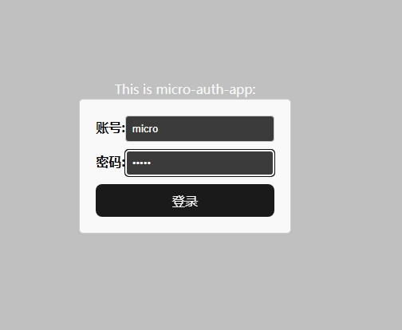
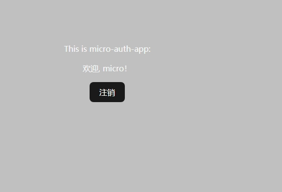

# Hixtrip FE Online

## 前端高级/架构师需求

请移步至[v1 分支](https://github.com/hixtrip/fe-online/tree/v1)

## 准备

- fork 此仓库
- 根据如下要求实现相关代码
- 完成要求
  - 提交`pull request`
  - 提供页面截图

## 需求

> 当前已有初始化的`monorepo`仓库, 已经包含`backend/auth-service`, `apps/auth-app`, `apps/manage-app`项目。

- `backend/auth-service`项目已包含登陆接口、获取用户信息接口
  - 如何设计`BFF`层架构, 统一这两个接口，使得前端只需要调用一次登陆，返回登陆成功的`token`以及`用户信息`
- `auth-app` 采用`React`实现，`manage-app` 采用`Vue`实现
  - 需要使用`auth-app` 调用第一步实现的接口，并存储相关的`token`信息
  - `manage-app` 采用微前端方案内嵌 `auth-app`的功能

> 其他加分点：如何设计`git flow`规范, 设计`vue`, `react`, `backend`开发规范 etc. 或者请写出关于前端架构的思考，想法。

## 答
- `backend/auth-service` 加入一个新的route，整合`sign`和`getInfo`
- `manage-app`采用qiankun作为内嵌`auth-app`的方案。`qiankun`目前是不支持`vite`的，需要借助插件完成，安装`vite-plugin-qiankun`。
## 截图

