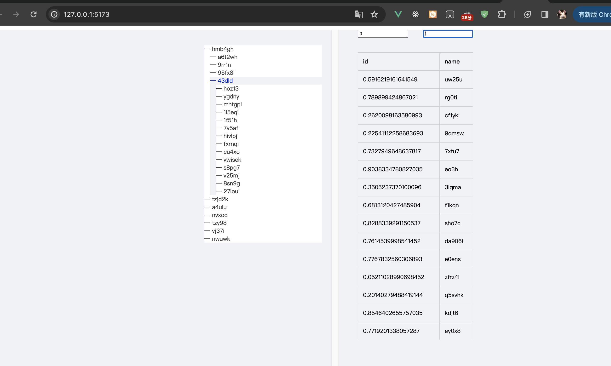

# Hixtrip FE Online

## 准备

- fork 此仓库
- 根据如下要求实现相关代码
- 完成要求
  - 提交`pull request`
  - 提供页面截图

## 需求

1. 目前已经有`src/api/user.ts` 以及 `src/api/org.ts` 两个 API
2. 需要实现如下效果界面：


> 功能要求：
- 不限 ```React``` 或者 ```Vue```
- 需要拆分 `OrgTree` 以及 `UserTable` 两个组件
  - 两个组件自己维护相关的数据。
  - 体现两个组件的互相通信。
- 组织架构根据点上级节点进行查询子级节点实现异步加载。
- 用户 ```Table ``` 数据跟据点击 ```组织架构树形节点``` 以及 ```输入搜索关键字``` 查询。
  - 需要考虑防抖节流等功能点
- 风格不限
  - 示例图仅仅是效果展示，不需要完全符合。
  - 可以使用 ```UI Framework```, 如 ```ant-design```, ```element-ui```等
  - 如果不用```UI Framework```, 可以直接用原生的```<ul> <li>```, ```<table>``` 实现，不用实现相关的CSS样式, 可以加分。
  


## 其他简答题

### 如何将如下的`JSON`正确解析成 `Object`
```json
{
  "userId": 111323290434354540545
}
```
可以使用一些第三库, 比如json-bigint.
或者也可以用正则替换的方式为数值套上一层引号, 比如/:\s*(\d+)\s*/, 这样json在parse时就会解析为字符串.
### 前端需要*稳定*每隔`1s`向服务端请求`API`, 请问如何实现？
  定时器有着最小4ms的阈值, 并且会等待主线程空闲才会去执行任务, 时间可能会不精确.
  除了定时器还可以使用requestAnimationFrame, 这个函数通常是用来优化动画效果, 但他也可以实现周期性调用函数, 
在循环调用这个方法时浏览器会以屏幕的刷新率去执行回调, 将每一段代码分别放置于每帧的最后去执行任务, 每次执行通过记录前后的时间差判断差值是否大于1秒去发送请求, 
不过这个函数在页面隐藏时会自动暂停, 如果要考虑这个问题需要结合其他方案.
  也可以使用WebWorker, 他可以在一个独立的线程里处理任务, 同样也不会导致页面堵塞, 在构造函数传入需要的执行脚本文件, 
通过postMessage和onmessage去循环执行判断时间差值发送请求.
### 什么情况下，你会为你的项目引入状态管理库，比如`Redux`, `Pinia`, 可以简述一下起到了什么作用么？
在多个组件需要共享状态或者项目比较复杂需要管理大量状态时, 使用状态管理库可以更好的组织代码.
### 为什么`ESM`与`CJS`不能兼容？
因为两套规范从设计到制定的规则到代码的处理都有很大的不同, 比如esm使用import和export来导入导出, 而cjs用require和module.export,
cjs使用类似同步的方式去执行代码, 而esm会在代码执行之前解析模块的依赖关系等等, 我觉得既然是两套设计, 那不管是从代码的维护性,还是扩展性各方面考虑, 
最好是有一个统一的方案, 如果真的没办法要进行混用, 那也要尽量避免抒写更多的差异代码.