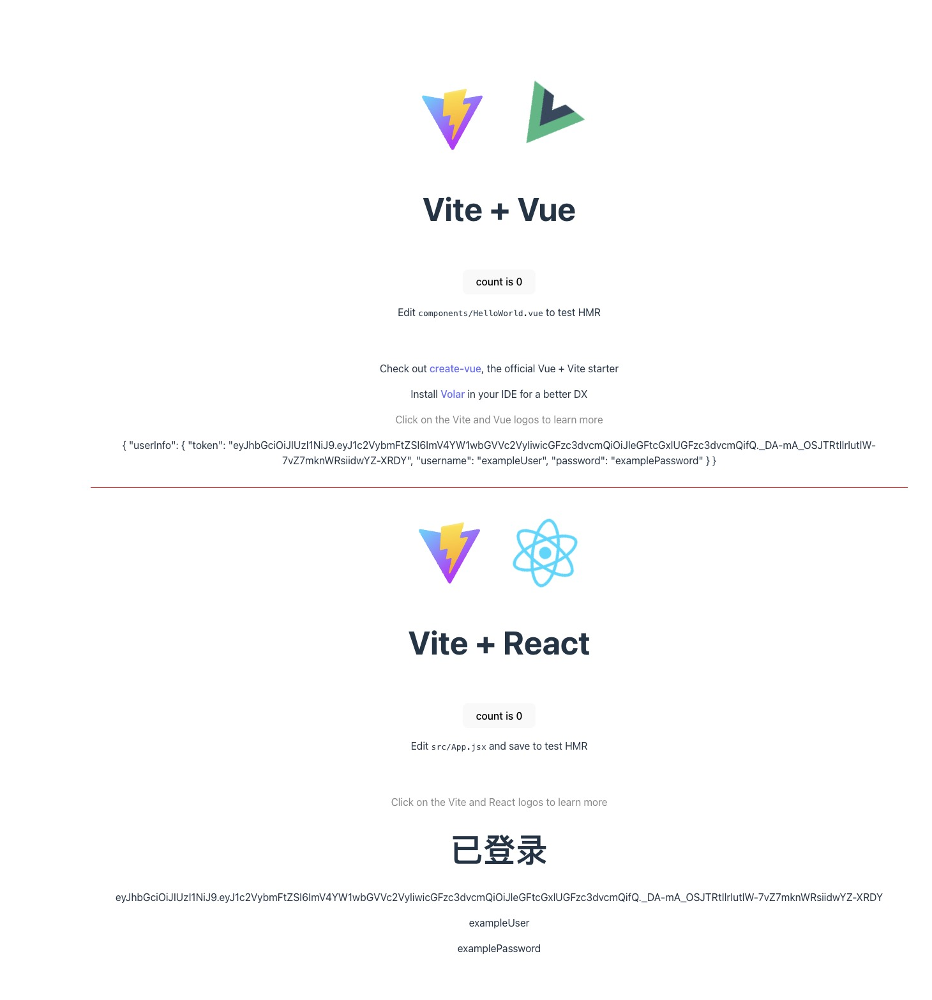

# Hixtrip FE Online

## 前端高级/架构师需求

请移步至[v1 分支](https://github.com/hixtrip/fe-online/tree/v1)

## 准备

- fork 此仓库
- 根据如下要求实现相关代码
- 完成要求
  - 提交`pull request`
  - 提供页面截图

## 需求

> 当前已有初始化的`monorepo`仓库, 已经包含`backend/auth-service`, `apps/auth-app`, `apps/manage-app`项目。

- `backend/auth-service`项目已包含登陆接口、获取用户信息接口
  - 如何设计`BFF`层架构, 统一这两个接口，使得前端只需要调用一次登陆，返回登陆成功的`token`以及`用户信息`
- `auth-app` 采用`React`实现，`manage-app` 采用`Vue`实现
  - 需要使用`auth-app` 调用第一步实现的接口，并存储相关的`token`信息
  - `manage-app` 采用微前端方案内嵌 `auth-app`的功能
    要求点：
- `BFF` 需要考虑微服务架构，对原有业务非侵入式
- `微前端` 设计不仅仅是需要采用`qiankun`， 而是如何设计一套微前端的数据通讯方案
  > 其他加分点：如何设计`git flow`规范, 设计`vue`, `react`, `backend`开发规范 etc. 或者请写出关于前端架构的思考，想法。

已实现：
1、auth-app调用第一步实现的接口，并存储相关的token信息 
2、manage-app接入乾坤内嵌auth-app
3、微前端的数据通讯方案：利用qiankun的数据通信api
4、如何设计`git flow`规范：
主分支（master）：用于存放稳定的、可发布的代码。
开发分支（develop）：用于存放最新的开发代码。
特性分支（feature branches）：用于开发新特性。
发布分支（release branches）：用于版本发布前的准备工作。
修复分支（hotfix branches）：用于紧急修复生产环境中的 bug。
Git Flow 适用于相对稳定的软件开发流程，适合需要严格版本控制和集中式发布管理的团队。它的优点是清晰的分支模型和明确的规范，有助于组织和管理复杂的开发过程。但它也可能会导致分支较多、流程较为繁琐的问题。
目前互联网和社区中流传最广泛的一个分支模型 Git Flow 出自 a-successful-git-branching-model 这篇十年前的文章，文章作者 Vincent Driessen 在 2020 年三月份的时候已经公开表示，该分支模型已经不适用于现如今持续交付的软件工程方式，推荐在持续交付的软件工程中使用更简单的 Github Flow 模型。
5、设计`vue`, `react`, `backend`开发规范 etc：
    1、首先eslint要配置统一的代码格式
    2、属性命名方式、一些已弃用或造成不可预测后果的方法要控制/禁止使用、常量的存储等
    3、HTML、CSS、JS的编码规范
    等
6、前端架构的思考，想法

    微前端结合 monorepo 的前端架构可以带来一些优势，特别是对于大型前端应用和跨团队协作的场景。
    1. 统一的代码仓库：
    使用 monorepo 可以将所有微前端模块的代码统一存放在一个代码仓库中，方便团队成员查看、管理和协作。这样可以避免代码分散、依赖管理困难等问题，提高团队的开发效率和代码的可维护性。

    2. 模块化设计：
    将微前端应用拆分成多个独立的模块，并使用 monorepo 来管理这些模块的代码。每个模块都可以有自己的目录结构、依赖管理和构建配置，使得模块之间的边界更清晰，开发和维护更容易。

    3. 共享代码和资源：
    在 monorepo 中，可以将公共的代码、组件库、样式库等资源统一管理，使得不同的微前端模块可以共享这些资源，避免重复开发和代码冗余。同时，也可以统一管理第三方依赖和工具库，提高代码的复用性和可维护性。

    4. 统一的构建和部署流程：
    通过 monorepo，可以统一管理微前端应用的构建和部署流程，使得各个模块的构建和部署过程更加一致和可控。可以使用工具如 Lerna、等来管理 monorepo 中的多个子项目，并结合 CI/CD 工具来实现自动化构建和部署。

    5. 独立开发和测试：
    在 monorepo 中，每个微前端模块都可以独立进行开发、测试和部署，使得团队可以更灵活地进行模块化开发和迭代。同时，也可以通过模拟环境或者集成测试来验证模块之间的交互和依赖关系。

    6. 版本管理和发布流程：
    通过 monorepo，可以更方便地管理微前端应用的版本号和发布流程。可以在 monorepo 中统一管理各个模块的版本依赖关系，并根据需求进行版本发布和回滚，提高版本管理的可控性和灵活性。

    7. 团队协作和沟通：
    monorepo 可以促进团队成员之间的协作和沟通，使得团队可以更加高效地共享知识、交流经验，并统一团队的工作流程和开发规范，提高团队的整体协作能力和项目的成功率。

    综上所述，微前端结合 monorepo 的前端架构可以带来诸多优势，包括统一的代码仓库、模块化设计、共享代码和资源、统一的构建和部署流程、独立开发和测试、版本管理和发布流程以及团队协作和沟通等方面。通过合理设计和实施这种架构，可以有效提高团队的开发效率和项目的可维护性，适用于大型前端项目和跨团队协作的场景。
