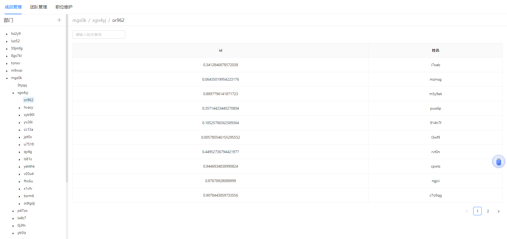

# Hixtrip FE Online

## 准备

- fork 此仓库
- 根据如下要求实现相关代码
- 完成要求
  - 提交`pull request`
  - 提供页面截图

## 需求

1. 目前已经有`src/api/user.ts` 以及 `src/api/org.ts` 两个 API
2. 需要实现如下效果界面：



> 功能要求：
- 不限 ```React``` 或者 ```Vue```
- 需要拆分 `OrgTree` 以及 `UserTable` 两个组件
  - 两个组件自己维护相关的数据。
  - 体现两个组件的互相通信。
- 组织架构根据点上级节点进行查询子级节点实现异步加载。
- 用户 ```Table ``` 数据跟据点击 ```组织架构树形节点``` 以及 ```输入搜索关键字``` 查询。
  - 需要考虑防抖节流等功能点
- 风格不限
  - 示例图仅仅是效果展示，不需要完全符合。
  - 可以使用 ```UI Framework```, 如 ```ant-design```, ```element-ui```等
  - 如果不用```UI Framework```, 可以直接用原生的```<ul> <li>```, ```<table>``` 实现，不用实现相关的CSS样式, 可以加分。

## 其他简答题

### 如何将如下的`JSON`正确解析成 `Object`
```json
{
  "userId": 111323290434354540545
}
1.使用现有的依赖比如jsondom 之类的json处理工具去处理 
2.json.parser(json) 然后获取当前key和value 通过object 上面的set来操作参数
```
### 前端需要*稳定*每隔`1s`向服务端请求`API`, 请问如何实现？
 1. 使用轮询来操作比如 设置一个timeout去访问 然后再设置一个timeout来关闭timer 相当于一个垃圾回收机制
 2. websocket 建立新的连接 每隔1s来访问服务器
 3. 新一代的tcp协议去取代websocket

### 什么情况下，你会为你的项目引入状态管理库，比如`Redux`, `Pinia`, 可以简述一下起到了什么作用么？

1. 当你需要这个参数的状态的时候 比如你需要在多个页面获取这个参数或者去修改参数状态 就可以使用这个pinia 或者vuex
2. 作用:多页面共享参数 多页面使用参数的状态 多页面修改参数的状态 

### 为什么`ESM`与`CJS`不能兼容？
1. 主要是导入方式的不用 node 一般用require 来导入导出 而web页面使用import 
2. 一个静态加载就是你要不要都加载 一个动态加载你要再加载
