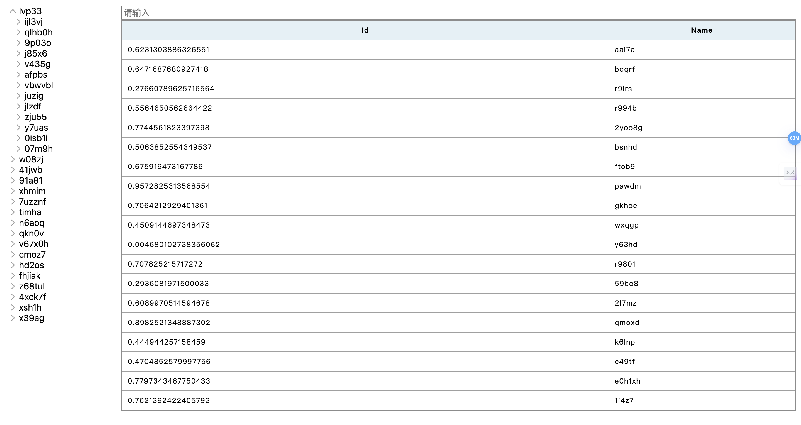

# Hixtrip FE Online

## 准备

- fork 此仓库
- 根据如下要求实现相关代码
- 完成要求
  - 提交`pull request`
  - 提供页面截图

## 需求

1. 目前已经有`src/api/user.ts` 以及 `src/api/org.ts` 两个 API
2. 需要实现如下效果界面：




> 功能要求：
- 不限 ```React``` 或者 ```Vue```
- 需要拆分 `OrgTree` 以及 `UserTable` 两个组件
  - 两个组件自己维护相关的数据。
  - 体现两个组件的互相通信。
- 组织架构根据点上级节点进行查询子级节点实现异步加载。
- 用户 ```Table ``` 数据跟据点击 ```组织架构树形节点``` 以及 ```输入搜索关键字``` 查询。
  - 需要考虑防抖节流等功能点
- 风格不限
  - 示例图仅仅是效果展示，不需要完全符合。
  - 可以使用 ```UI Framework```, 如 ```ant-design```, ```element-ui```等
  - 如果不用```UI Framework```, 可以直接用原生的```<ul> <li>```, ```<table>``` 实现，不用实现相关的CSS样式, 可以加分。

## 其他简答题

### 如何将如下的`JSON`正确解析成 `Object`
```json
{
  "userId": 111323290434354540545
}
```
### 前端需要*稳定*每隔`1s`向服务端请求`API`, 请问如何实现？
可以使用setInterval做轮训查询，
setInterval(() => {
  //请求方法
}, 1000)
### 什么情况下，你会为你的项目引入状态管理库，比如`Redux`, `Pinia`, 可以简述一下起到了什么作用么？
对于全局数据，多组件依赖数据比较多又或者状态更新伴随比较复杂的业务逻辑修改等情况下，会引入状态管理库；
作用：将全局数据放入到状态管理库中方便管理传输，避免跨组件传递通过props一层层传递，并且修改数据统一方式方便追踪数据的修改
### 为什么`ESM`与`CJS`不能兼容？
因为ESM是异步加载，使用import导入具备静态分析，export导出；而CJS是同步加载，使用requier导入是动态导入，module.exports导出；
二者在语法，静态分析的差别以及加载机制的不同使得二者无法兼容
